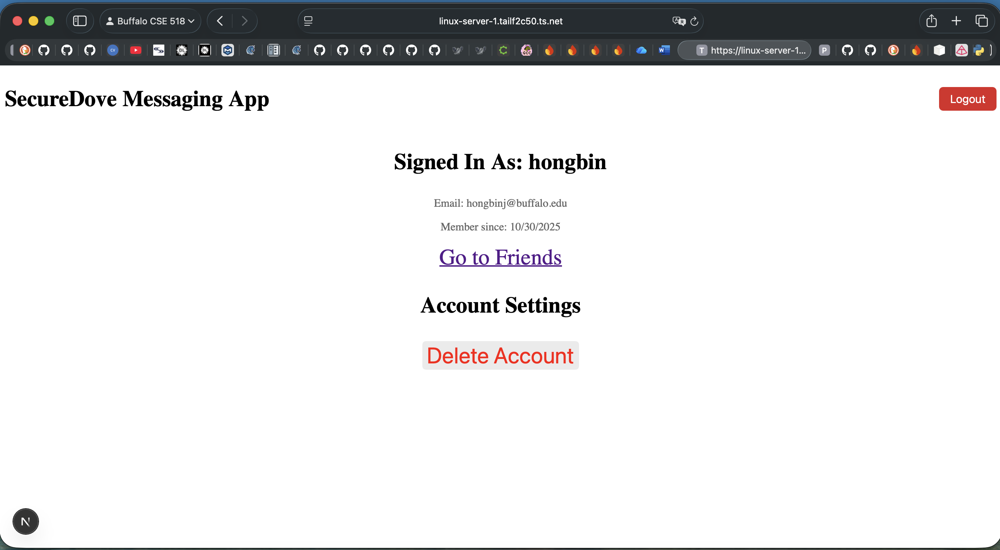

# Local Environment for Attacking

In order to facilitate testing and attacking the target messaging system, we
have investigated about how to set up a local instance of the target system.
Ultimately, we have brouhgt up such an instance and found several
vulnerabilities. This document serves as a tutorial to run the target system
locally, and records security weaknesses we found with the assistance of our
local environment.

## 1 Setting up a local instance

### 1.1 Getting source code

We have made some changes to the source code of the target system. Changes are
provided as a patch file ([local.patch](./patches/local.patch)). You can follow
the following steps to get source code and apply the patch.

```shell
# Run the following commands on the host machine
$ cd $HOME && git clone git@github.com:Firecon123/CSE-518-The_Vulwitch_Trials.git vulwitch
$ cd $HOME && git clone git@github.com:BrendanDupuis/CSE418-Project.git webapp
$ cd $HOME/webapp
$ git checkout e4109b0729aa624dc6b2e2664133e395c4c60076
$ git apply $HOME/vulwitch/attack/local_environment/patches/local.patch
```

### 1.2 Creating Firebase API keys

Running the messaging system requires both a Firebase client API key and an
admin key.

First, you need to create a Firebase project and to enable Firebase Auth as well
as Firestore. Then, you have to create a client API key and modify the content
of `firebaseConfig` in `$HOME/webapp/src/lib/firebase.ts`.
according to your client API key. You could follow the instructions of [Firebase
Project Setup: Your Complete Getting Started Guide 🔥](https://dev.to/this-is-learning/firebase-project-setup-your-complete-getting-started-guide-3k23).

Moreover, a Firebase admin API key is needed. You can create one according to
[Create a Firebase Service Account Key](https://medium.com/full-stack-engineer/create-a-firebase-service-account-key-14c16ccc37a6).
Then, you should substitute you key for placeholds in
`$HOME/webapp/firebase-admin.json`.

Finally, you need to replace the rules of your Firestore instance with those in
`$HOME/webapp/firestore.rules`.

### 1.3 Building a Docker image

We are running our local instance in a Docker container.

```shell
# Run the following commands on the host machine
$ cd $HOME/vulwitch
$ docker build --file attack/local_environment/docker/Dockerfile -t attack-local-env ./
$ docker run -v $HOME/webapp:/root/webapp -p 8080:80 -it --name local-attack attack-local-env:latest
```

### 1.4 Running a local instance

A CA-issued or self-assigned SSL certificate is required to run the code. We are
running the local instance on a personal computer, and accessing it via VPN
functionalities provided by [Tailscale](https://tailscale.com). Thus, we are
using an SSL certificate issued by [Let's Encrypt](https://letsencrypt.org).
The certificate and the private key are generated via Tailscale's commond-line
tool.

```shell
# Run the following commands on the host machine
$ cd $HOME/webapp
$ sudo tailscale cert linux-server-1.tailf2c50.ts.net
```

```shell
# Run the following commands inside the Docker container
$ pnpm install
$ pnpm run dev -p 80 \
    --experimental-https \
    --experimental-https-key ./linux-server-1.tailf2c50.ts.net.key \
    --experimental-https-cert ./linux-server-1.tailf2c50.ts.net.crt
```

For devices with [Tailscale clients](https://tailscale.com/download) and
connected to our internal network, you can access our local instance at
`https://linux-server-1.tailf2c50.ts.net:8080`. A local instance should look
like the following one.



Our local instance have some features disabled:

1. Our local instance does not send emails containing verification code to users
when they are logging into the system. Instead, verification code is static and
always 666666.

2. To facilitate testing and attacking, rate limiting is disabled.

## 2. Vulnerabilities

### 2.1 Abusing Firebase client API keys

### 2.2 Blocking users from login
