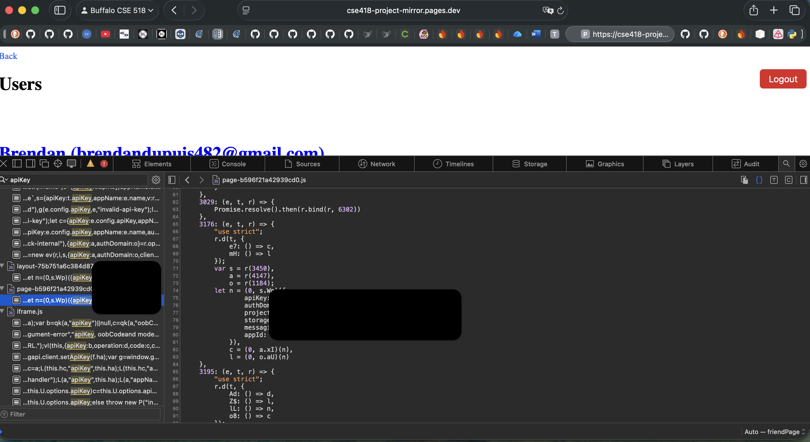
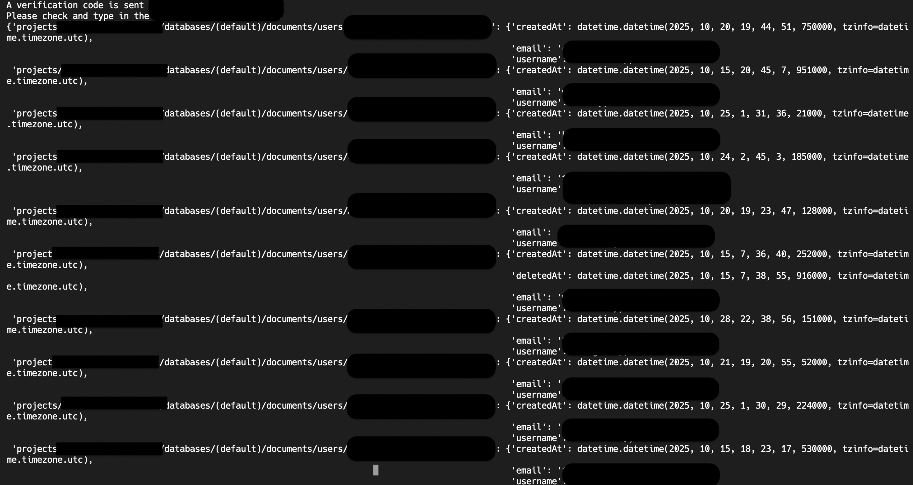

# Abusing Firebase Client APIs

You can extract the Firebase client API key from the web pages by searching with
the keyword "apiKey" agains all source files in your browser. For example,



Next, you need to change [attack\_config\_template.json](./attack_config_template.json)
to reflect the discovered key, URL of the target server, and your account.

We provide a script to show all existing users in the system. You can do that by
executing

```shell
(cse518-attack) $ python attack.py attack_config_template.json
```

This should display information of all users, e.g.,


