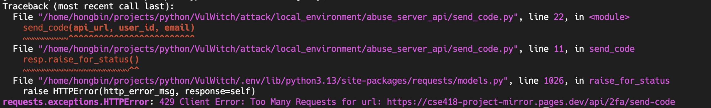
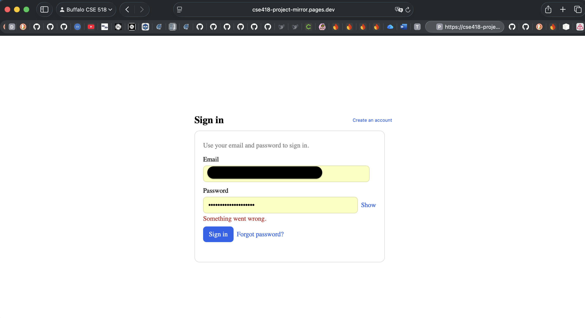

# Abusing Server APIs

You can block a certain user from logging into the system by exploiting a server
API for sending two-factor verification code. Only user id and email address are
needed. For example,

```shell
(cse518-attack) $ python send_code.py \
    https://linux-server-1.tailf2c50.ts.net:8080/api/2fa/send-code \
    your-user-id \
    your-email-address \
    20
```

We have tried this attack to the target system. A successful attack should block
that user from the system as below




